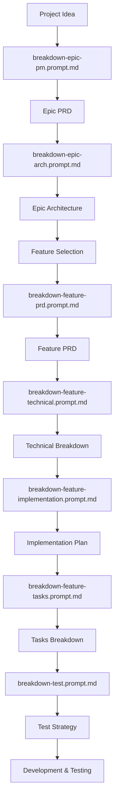

# How to Use Breakdown Prompts

This guide explains how to use the comprehensive set of breakdown prompts to systematically plan and develop software projects from initial concept to implementation.

## Overview

The breakdown prompts provide a structured workflow for taking high-level project ideas and systematically breaking them down into actionable development work. The process follows a logical progression from business requirements through technical specifications to executable tasks.

## Complete Workflow



## Step-by-Step Process

### Phase 1: Epic Planning

#### Step 1: Create Epic PRD
**Prompt**: `breakdown-epic-pm.prompt.md`
**Input**: High-level project idea, business objectives
**Output**: `/docs/ways-of-work/plan/{epic-name}/epic.md`

**Usage**:
1. Describe your project idea and business goals
2. Run the prompt to generate comprehensive Epic PRD
3. Review and refine requirements, user personas, success metrics

#### Step 2: Create Epic Architecture  
**Prompt**: `breakdown-epic-arch.prompt.md`
**Input**: Epic PRD
**Output**: `/docs/ways-of-work/plan/{epic-name}/arch.md`

**Usage**:
1. Provide the Epic PRD as context
2. Run the prompt to generate system architecture
3. Review technology choices, system design, and complexity estimates

### Phase 2: Feature Development

#### Step 3: Create Feature PRD
**Prompt**: `breakdown-feature-prd.prompt.md`
**Input**: Epic PRD, Epic Architecture, specific feature to develop
**Output**: `/docs/ways-of-work/plan/{epic-name}/{feature-name}/prd.md`

**Usage**:
1. Select a specific feature from the Epic to develop
2. Provide Epic context and feature focus
3. Generate detailed feature requirements and user stories

#### Step 4: Create Technical Breakdown
**Prompt**: `breakdown-feature-technical.prompt.md`
**Input**: Feature PRD, Epic Architecture
**Output**: `/docs/ways-of-work/plan/{epic-name}/{feature-name}/technical-breakdown.md`

**Usage**:
1. Provide Feature PRD and Epic Architecture as context
2. Generate detailed technical specifications
3. Review API designs, database schemas, security considerations

#### Step 5: Create Implementation Plan
**Prompt**: `breakdown-feature-implementation.prompt.md`
**Input**: Feature PRD, Technical Breakdown
**Output**: `/docs/ways-of-work/plan/{epic-name}/{feature-name}/implementation-plan.md`

**Usage**:
1. Provide Feature PRD and Technical Breakdown as context
2. Generate detailed system architecture and implementation specifications
3. Review database schemas, API designs, component hierarchies, and deployment architecture

#### Step 6: Create Tasks Breakdown
**Prompt**: `breakdown-feature-tasks.prompt.md`
**Input**: Feature PRD, Technical Breakdown, Implementation Plan
**Output**: `/docs/ways-of-work/plan/{epic-name}/{feature-name}/tasks-breakdown.md`

**Usage**:
1. Provide Feature PRD, Technical Breakdown, and Implementation Plan as context
2. Generate granular development tasks with estimates based on the implementation architecture
3. Review task dependencies and sprint planning recommendations

#### Step 7: Create Test Strategy
**Prompt**: `breakdown-test.prompt.md`
**Input**: Feature PRD, Technical Breakdown, Implementation Plan, Tasks Breakdown
**Output**: `/docs/ways-of-work/plan/{epic-name}/{feature-name}/test-strategy.md`

**Usage**:
1. Provide feature documents, implementation plan, and task breakdown
2. Generate comprehensive testing strategy
3. Review test coverage, automation requirements, quality gates

## Document Relationships

### Input Dependencies
```
Epic PRD ──┐
           ├─→ Feature PRD
Epic Arch ─┘
           
Feature PRD ──┐
              ├─→ Technical Breakdown
Epic Arch ────┘

Feature PRD ────────┐
                    ├─→ Implementation Plan  
Technical Breakdown ┘

Feature PRD ─────────┐
Technical Breakdown ─┤
                     ├─→ Tasks Breakdown
Implementation Plan ─┘

Feature PRD ─────────┐
Technical Breakdown ─┤
Implementation Plan ─┤
                     ├─→ Test Strategy
Tasks Breakdown ─────┘
```

### Purpose of Each Document

| Document | Purpose | Key Stakeholders |
|----------|---------|------------------|
| Epic PRD | Business requirements, user needs, success metrics | Product Managers, Stakeholders |
| Epic Architecture | System design, technology stack, complexity estimates | Architects, Engineering Managers |
| Feature PRD | Detailed feature requirements, user stories | Product Managers, Engineers |
| Technical Breakdown | Implementation specifications, API/DB design | Senior Engineers, Architects |
| Tasks Breakdown | Granular development tasks, effort estimates | Engineering Managers, Developers |
| Implementation Plan | Development roadmap, phases, timelines | Project Managers, Engineering Managers |
| Test Strategy | Testing approach, quality assurance plan | QA Engineers, Engineering Managers |

## Best Practices

### 1. Sequential Execution
- **Always complete each step before moving to the next**
- Each document builds upon previous outputs
- Don't skip steps as they provide critical context

### 2. Context Preservation
- **Always provide all relevant previous documents as context**
- Include links to parent documents in each new document
- Maintain consistency across all documents

### 3. Iterative Refinement
- **Review and refine documents after generation**
- Update parent documents if significant changes emerge
- Ensure alignment between business and technical requirements

### 4. Stakeholder Review
- **Get appropriate stakeholder sign-off at each phase**
- Epic level: Product leadership approval
- Feature level: Engineering and product alignment
- Technical level: Architecture review

### 5. Version Control
- **Commit each document to version control when complete**
- Tag major milestones (Epic complete, Feature complete)
- Maintain document version history

## Common Patterns

### For New Projects
1. Start with Epic PRD and Architecture
2. Identify 2-3 core features for MVP
3. Develop features in priority order
4. Build foundation features before advanced features

### For Existing Projects
1. Create Epic PRD and Architecture if missing
2. Select next priority feature
3. Follow feature development workflow
4. Ensure integration with existing architecture

### For Complex Features
1. Consider breaking large features into smaller sub-features
2. Use feature hierarchies (parent/child features)
3. Develop core functionality first, then extensions
4. Plan for iterative delivery

## File Organization

```
docs/
└── ways-of-work/
    └── plan/
        └── {epic-name}/
            ├── epic.md
            ├── arch.md
            └── {feature-name}/
                ├── prd.md
                ├── technical-breakdown.md
                ├── tasks-breakdown.md
                ├── implementation-plan.md
                └── test-strategy.md
```

## Quality Gates

### Epic Level
- [ ] Business value clearly articulated
- [ ] User personas and journeys defined
- [ ] Success metrics established
- [ ] Technical feasibility confirmed

### Feature Level
- [ ] User stories with acceptance criteria
- [ ] Technical specifications complete
- [ ] Development tasks estimated
- [ ] Implementation plan reviewed
- [ ] Test strategy approved

### Implementation Ready
- [ ] All dependencies identified
- [ ] Resource requirements clear
- [ ] Risk mitigation planned
- [ ] Quality gates defined

## Tips for Success

1. **Start Small**: Begin with a simple feature to validate the process
2. **Be Specific**: Vague requirements lead to implementation confusion
3. **Consider Constraints**: Technical debt, team skills, timeline pressures
4. **Plan for Quality**: Don't skip testing and documentation steps
5. **Communicate Early**: Share documents with stakeholders for feedback
6. **Learn and Adapt**: Refine the process based on project learnings

## Troubleshooting

### Common Issues

**"Requirements keep changing"**
- Lock down Epic PRD before starting features
- Use formal change control for scope modifications
- Focus on MVP features first

**"Technical breakdown too complex"**
- Break large features into smaller components
- Focus on one integration at a time
- Simplify initial implementation, plan enhancements

**"Tasks too large/small"**
- Target 1-8 story points per task
- Break XL tasks into smaller pieces
- Combine XS tasks where logical

**"Implementation plan unrealistic"**
- Review effort estimates with development team
- Account for testing, code review, documentation time
- Add buffer for unknowns and learning curve

---

**Document Version**: v1.0  
**Created**: September 19, 2025  
**Author**: AI Engineering Assistant (GitHub Copilot)